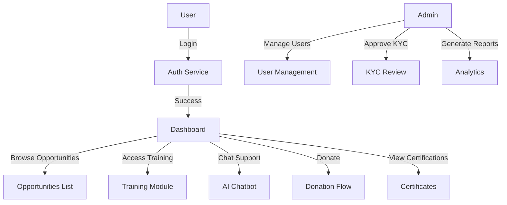
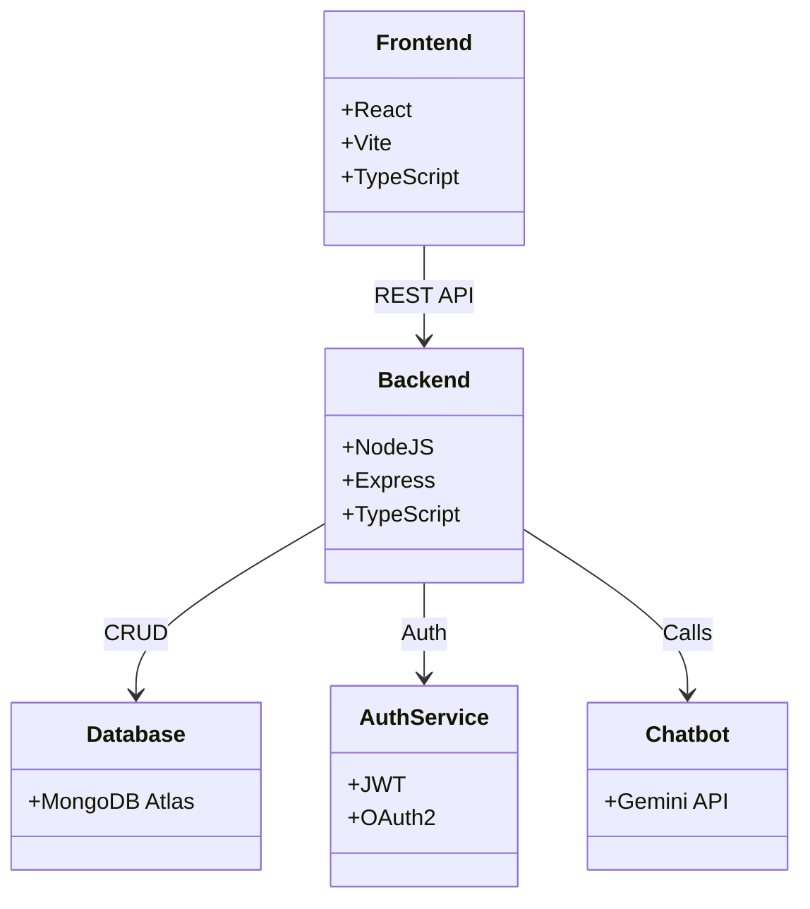
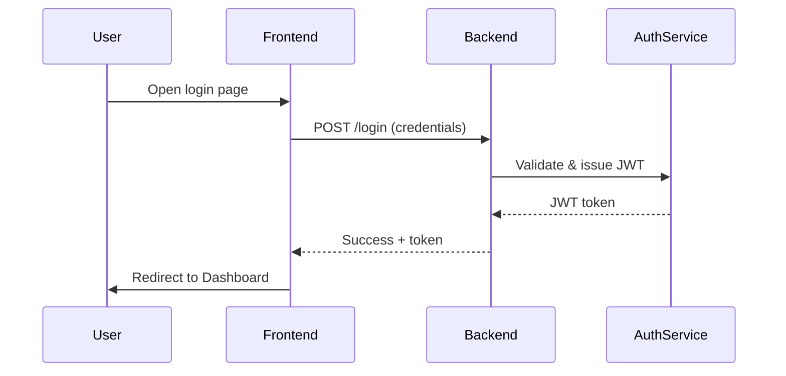

# Team Details

## Team Name

**NGO Connect Team**

## Team Leader

**Saikiran 9015**

## Problem Statement

Non‑profits and NGOs often struggle with fragmented volunteer and donor management, lack of real‑time communication, and inefficient onboarding processes. This leads to missed opportunities, delayed aid, and limited impact.

---

## Solution Overview

### Brief About Your Solution

**NGO Connect** is a unified web platform that streamlines interactions between NGOs, volunteers, and donors. It provides role‑based dashboards, KYC verification, real‑time chat, training modules, and certification management, all hosted on a modern stack.

### Opportunities

- Centralized volunteer & donor coordination
- Automated KYC and certification workflows
- Real‑time communication via AI‑powered chatbot
- Scalable cloud deployment for NGOs of any size

### Differentiation

**How different is it from existing ideas?**

Unlike generic fundraising sites, NGO Connect offers an end‑to‑end solution: role‑specific portals, integrated training, AI chat assistance, and secure KYC, built with a seamless UI/UX and open‑source flexibility.

### Problem Solving

**How will it solve the problem?**

- **Unified Dashboard:** Admins manage volunteers, donors, and projects from a single interface.
- **KYC Automation:** Verify identities quickly to ensure compliance.
- **AI Chatbot:** Provides instant support and guides users through processes.
- **Training & Certification:** Upskill volunteers and showcase achievements.

### USP (Unique Selling Proposition)

A premium, all‑in‑one platform that combines volunteer management, donor engagement, AI assistance, and compliance tools in a sleek, glass‑morphic UI.

---

## Features

- Role‑based Admin, Volunteer, Donor dashboards
- Secure authentication (JWT/OAuth)
- KYC verification workflow
- Real‑time AI chatbot integration
- Training courses & certification issuance
- Notification system for emergencies and updates
- Donation tracking and impact analytics
- Responsive design with dark mode and micro‑animations

---

## Process Flow / Use‑Case Diagram



---

## Wireframes / Mock Diagrams (optional)

> *Insert wireframe images or sketches here. Use markdown image syntax once the files are available.*

---

## Architecture Diagram

```mermaid
graph LR
    FE[Frontend (React/Vite)] -->|REST API| BE[Backend (Node/Express)]
    BE --> DB[(MongoDB Atlas)]
    BE --> Auth[Auth Service (JWT/OAuth)]
    FE --> UI[UI Components & State Management]
    BE --> Chat[AI Chatbot Service]
```

---

## Technologies

- **Frontend:** React, Vite, TypeScript, Tailwind CSS, Framer Motion
- **Backend:** Node.js, Express, TypeScript, JavaScript
- **Database:** MongoDB Atlas
- **Authentication:** JWT, OAuth2
- **AI Services:** Gemini API (for chatbot)
- **Deployment:** Vercel (frontend) + Railway (backend)
- **Containerisation:** Docker
- **CI/CD:** GitHub Actions

---

## Estimated Implementation Cost (optional)

| Phase                     | Estimated Hours | Cost (USD) |
|---------------------------|-----------------|------------|
| Planning & Design         | 40              | 2,000      |
| Frontend Development      | 120             | 6,000      |
| Backend Development       | 100             | 5,000      |
| AI Integration & Testing  | 60              | 3,000      |
| Deployment & DevOps       | 30              | 1,500      |
| **Total**                 | **350**         | **$17,500** |

---

## MVP Snapshots

> *Add screenshots or GIFs of the MVP here.*

---

## Additional Details / Future Development

- Multi‑language support
- Mobile app companion (React Native)
- Advanced analytics dashboard with impact metrics
- Integration with third‑party fundraising platforms
- Community forum for volunteers

---

## Working Flow Diagram

```mermaid
flowchart LR
    FE[Frontend (React/Vite)] -->|REST API| BE[Backend (Node/Express)]
    BE --> DB[(MongoDB Atlas)]
    BE --> Auth[Auth Service (JWT/OAuth)]
    FE --> Chat[AI Chatbot Service]
```

## UML Diagrams

### Class Diagram



### Sequence Diagram (Login Flow)



```

## Links

- **GitHub Public Repository:** [ngo-connect-web](https://github.com/yourusername/ngo-connect-web)
- **Demo Video (3 min):** [Demo Video](https://www.youtube.com/watch?v=demo-video)
- **MVP Link:** [Live MVP](https://ngo-connect-web.vercel.app)
- **Working Prototype Link:** [Prototype](https://prototype.ngo-connect.com)
